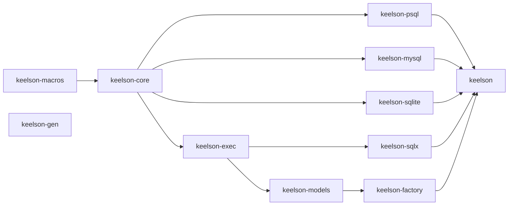

# Publishing

What the workspace looks like from crates.io's side: which crates ship, in what
order they can be published, how packaging is verified, and what is still
missing before a first release.

## The crates

Eleven crates ship; one does not.

| crate | ships | what a user gets from it |
| --- | --- | --- |
| `keelson` | yes | the facade: re-exports the rest behind features, so the common case is one dependency line |
| `keelson-core` | yes | Layer 0 — `Value`, `Expression`, `Mod`, `Query`, `SqlWriter`, the clause traits |
| `keelson-psql` | yes | Layer 1, PostgreSQL |
| `keelson-mysql` | yes | Layer 1, MySQL |
| `keelson-sqlite` | yes | Layer 1, SQLite |
| `keelson-exec` | yes | Layer 2 traits, driver-free |
| `keelson-sqlx` | yes | Layer 2 backend over sqlx's three drivers |
| `keelson-models` | yes | Layer 3 runtime |
| `keelson-factory` | yes | Layer 3 test-data runtime |
| `keelson-macros` | yes | the derives; reached through `keelson-core`'s `macros` feature |
| `keelson-gen` | yes | Layer 4 — the generator, installed as a CLI |
| `keelson-sqlcheck` | **no** (`publish = false`) | the test judge: grammar parsers and real engines |

`keelson-sqlcheck` is deliberately unpublished. It exists to judge keelson's own
output, it depends on three parsers and a container runtime, and it reads the
shared schema from the repository's `tests/schema/` directory through
`include_str!` — paths that only resolve inside a checkout. It is a
dev-dependency of eight crates and of nothing a user builds.

## Dependency order

A crate can only be published after everything it depends on. `A → B` below
means *B depends on A*, so A is published first. Only normal dependencies are
drawn; the dev-dependency edges (which run in both directions and are what make
`cargo test` build almost the whole workspace) do not constrain publishing,
because cargo strips a path-only dev-dependency from a packaged manifest.



`keelson-gen` is off on its own: it depends on no keelson crate at all. It is a
generator — it *writes* code against keelson-models and keelson-factory, and
takes both as dev-dependencies so its tests can compile and run what it wrote,
but it links neither.

Publish order:

1. `keelson-macros`
2. `keelson-core`
3. `keelson-psql`, `keelson-mysql`, `keelson-sqlite`, `keelson-exec`
4. `keelson-sqlx`, `keelson-models`
5. `keelson-factory`
6. `keelson-gen`
7. `keelson`

`keelson-macros` goes first even though `keelson-core` re-exports it, because
the dependency runs that way: core depends on macros, and macros depends on
core only as a *dev*-dependency (its tests prove the derives through the
re-export path a user takes). That cycle is why every intra-workspace
**dev**-dependency is declared with a path and no version — cargo strips a
path-only dev-dependency from the packaged manifest, and a version there would
demand that the other half of the cycle already exist on crates.io. Normal
dependencies carry `version` beside `path`, which `cargo package` requires.

## Verifying a package before publishing

```sh
cargo package --workspace --exclude keelson-sqlcheck --exclude keelson-examples --allow-dirty
```

This packages each crate into `target/package/*.crate` and then *builds* each
tarball in isolation, resolving intra-workspace dependencies against the other
tarballs. It catches the two failure modes that a normal `cargo build` cannot:
a file the crate reads but does not ship (an `include_str!` reaching outside
the package directory), and metadata a registry requires.

The `--exclude`s are not optional: `cargo package --workspace` packages
`publish = false` crates too. `keelson-sqlcheck` cannot survive the trip for
the `include_str!` reason above, and `keelson-examples` depends on `keelson` by
path alone — deliberately, since it is the repository's own examples and there
is no released version for it to name. Excluding both verifies exactly the set
that would be published.

Every published crate carries `description`, `license`, `repository` and
`authors`; the first three are what crates.io rejects an upload for.

**Run it twice locally and the second run can lie.** Verification builds each
tarball as a *registry* dependency, and cargo treats a registry package as
immutable: the build fingerprint is keyed on name and version, and this
workspace's version never moves off `0.0.0`. So a second `cargo package` after
a source change can link the first run's artifacts and fail on a symbol that is
plainly there — or, worse, pass on one that is not. The fix is a clean target
directory:

```sh
CARGO_TARGET_DIR=$(mktemp -d) cargo package --workspace --exclude keelson-sqlcheck --exclude keelson-examples --allow-dirty
```

CI is unaffected — a fresh runner has nothing to reuse — and so is the real
publish, where each release carries a new version. This is a local-loop trap
only, and it goes away the moment versions start moving.

## One README, one LICENSE, eleven packages

`README.md` and `LICENSE` exist once, at the repository root, and every
published crate directory holds a **symlink** to them. Cargo follows the link
when packaging, so each `.crate` ships the real text: the MIT licence travels
with the code it licenses, as the licence itself requires, and no crates.io
page is blank.

The `keelson` facade goes one step further and *is* its README —
`#![doc = include_str!("../README.md")]` — which is what makes the worked
example a doctest rather than a snippet that rots, and puts one text on
crates.io, docs.rs and GitHub.

The alternative — copies, kept in step by a test — was rejected for the reason
copies usually are: the test tells you they diverged, after they have. The one
real cost of the symlink is a checkout without symlink support (Git for Windows
leaves `core.symlinks` off by default), where the file becomes the *text* of the
link target: everything still compiles, the crate documentation silently becomes
the string `../../README.md`, and the doctest silently ceases to exist.
`crates/keelson/tests/readme.rs` exists to make that loud instead.

## The feature matrix

The facade crate's features are the release's public API in a second sense: a
combination that does not compile is a broken dependency line. They are checked
by

```sh
./scripts/feature-matrix.sh
```

which compiles the empty set, every feature alone, and the combinations an
application would actually write. CI runs it on every pull request.

## What still has to happen before a first release

- **A version.** Everything is `0.0.0`, which is a placeholder, not a release.
  One version for the whole workspace — they are released together and depend
  on each other by version — bumped in `[workspace.package]` **and** in the
  `version = "0.0.0"` of each `[workspace.dependencies]` entry, which is the
  requirement the packaged manifests carry.
- **A `CHANGELOG.md`**, starting at the first released version.
- **Ownership and naming.** All eleven names were unregistered on crates.io
  when this document was written (every `GET /api/v1/crates/<name>` answered
  404). Nothing reserves them: the first upload claims each one, and until then
  anybody else can.
- **`cargo publish`, in the order above**, one crate at a time, waiting for the
  index to catch up between steps. Nothing in this repository has ever run
  `cargo publish`.
- **docs.rs check after the first upload.** Each crate declares what docs.rs
  should build it with (`[package.metadata.docs.rs]`); that declaration has
  been exercised locally with `cargo doc --no-deps` per feature set, but only
  the real docs.rs build proves it.
