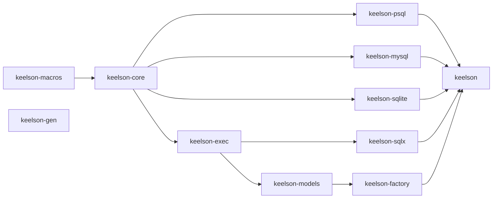

# Publishing

What the workspace looks like from crates.io's side: which crates ship, in what
order they can be published, how packaging is verified, and how a release is
cut.

## The crates

Eleven crates ship. Five members do not: `keelson-sqlcheck`,
`keelson-examples`, `keelson-facade-consumer`, `keelson-benches` and
`keelson-tokio-postgres`.

| crate | ships | what a user gets from it |
| --- | --- | --- |
| `keelson` | yes | the facade: re-exports the rest behind features, so the common case is one dependency line |
| `keelson-core` | yes | Layer 0 — `Value`, `Expression`, `Mod`, `Query`, `SqlWriter`, the clause traits |
| `keelson-psql` | yes | Layer 1, PostgreSQL |
| `keelson-mysql` | yes | Layer 1, MySQL |
| `keelson-sqlite` | yes | Layer 1, SQLite |
| `keelson-exec` | yes | Layer 2 traits, driver-free |
| `keelson-sqlx` | yes | Layer 2 backend over sqlx's three drivers |
| `keelson-models` | yes | Layer 3 runtime |
| `keelson-factory` | yes | Layer 3 test-data runtime |
| `keelson-macros` | yes | the derives; reached through `keelson-core`'s `macros` feature |
| `keelson-gen` | yes | Layer 4 — the generator, installed as a CLI |
| `keelson-sqlcheck` | **no** (`publish = false`) | the test judge: grammar parsers and real engines |
| `keelson-benches` | **no** (`publish = false`) | the criterion benchmarks for `Query::build()` |
| `keelson-tokio-postgres` | **no** (`publish = false`) | the second Layer 2 backend, which exists to prove there can be one |

`keelson-sqlcheck` is deliberately unpublished. It exists to judge keelson's own
output, it depends on three parsers and a container runtime, and it reads the
shared schema from the repository's `tests/schema/` directory through
`include_str!` — paths that only resolve inside a checkout. It is a
dev-dependency of eight crates and of nothing a user builds.

`keelson-facade-consumer` (`tests/facade-consumer`) is unpublished for a
different reason: it is a *reader*, not a library. It depends on `keelson` and
nothing else, which is the dependency line the README advertises and the one
shape no other member has — the macro crate takes the inner crates as
dev-dependencies, the examples crate takes them because generated code names
them directly, and even an integration test inside the facade inherits the
facade's own dependencies. 0.1.0 shipped with both derives unusable from that
seat because nothing here sat in it.

`keelson-benches` (`benches/`) is a member so that `cargo clippy --workspace
--all-targets` lints it and it cannot rot; it is a member *of its own*, rather
than a `benches/` directory inside each dialect crate, so that criterion never
appears in a published crate's dev-dependency graph. Nothing a consumer
resolves, and nothing the MSRV job has to accommodate.

`keelson-tokio-postgres` is unpublished for a reason worth stating plainly: it
is a *proof*, not a product. Its job is to be a second implementor of
keelson-exec's traits, so that "the execution layer is driver-free" is checked
by the compiler rather than asserted — with one backend, an accidental sqlx
assumption in keelson-exec would sit there unnoticed. It has no connection
pool, no feature matrix and no compatibility promise, and publishing it would
turn all three into someone's expectation. If a production tokio-postgres
backend is ever wanted, it starts from this file and grows the parts this one
deliberately skipped.

## Dependency order

A crate can only be published after everything it depends on. `A → B` below
means *B depends on A*, so A is published first. Only normal dependencies are
drawn; the dev-dependency edges (which run in both directions and are what make
`cargo test` build almost the whole workspace) do not constrain publishing,
because cargo strips a path-only dev-dependency from a packaged manifest.



`keelson-gen` is off on its own: it depends on no keelson crate at all. It is a
generator — it *writes* code against keelson-models and keelson-factory, and
takes both as dev-dependencies so its tests can compile and run what it wrote,
but it links neither.

Publish order:

1. `keelson-macros`
2. `keelson-core`
3. `keelson-psql`, `keelson-mysql`, `keelson-sqlite`, `keelson-exec`
4. `keelson-sqlx`, `keelson-models`
5. `keelson-factory`
6. `keelson-gen`
7. `keelson`

`keelson-macros` goes first even though `keelson-core` re-exports it, because
the dependency runs that way: core depends on macros, and macros depends on
core only as a *dev*-dependency (its tests prove the derives through the
re-export path a user takes). That cycle is why every intra-workspace
**dev**-dependency is declared with a path and no version — cargo strips a
path-only dev-dependency from the packaged manifest, and a version there would
demand that the other half of the cycle already exist on crates.io. Normal
dependencies carry `version` beside `path`, which `cargo package` requires.

## Verifying a package before publishing

```sh
cargo package --workspace \
  --exclude keelson-sqlcheck \
  --exclude keelson-examples \
  --exclude keelson-facade-consumer \
  --exclude keelson-benches \
  --exclude keelson-tokio-postgres \
  --allow-dirty
```

This packages each crate into `target/package/*.crate` and then *builds* each
tarball in isolation, resolving intra-workspace dependencies against the other
tarballs. It catches the two failure modes that a normal `cargo build` cannot:
a file the crate reads but does not ship (an `include_str!` reaching outside
the package directory), and metadata a registry requires.

The `--exclude`s are not optional: `cargo package --workspace` packages
`publish = false` crates too. `keelson-sqlcheck` cannot survive the trip for
the `include_str!` reason above; `keelson-examples` and
`keelson-facade-consumer` both depend on `keelson` by path alone —
deliberately, since they exist to compile against *this* checkout and there is
no released version for them to name, and `keelson-benches` and
`keelson-tokio-postgres` do the same with the crates they sit on. Excluding the
five verifies exactly the set that would be published.

Every published crate carries `description`, `license`, `repository` and
`authors`; the first three are what crates.io rejects an upload for.

**Run it twice locally and the second run can lie.** Verification builds each
tarball as a *registry* dependency, and cargo treats a registry package as
immutable: the build fingerprint is keyed on name and version, and the
workspace version only moves when a release is cut. So within one release
cycle, a second `cargo package` after a source change can link the first run's
artifacts and fail on a symbol that is plainly there — or, worse, pass on one
that is not. The fix is a clean target directory:

```sh
CARGO_TARGET_DIR=$(mktemp -d) cargo package --workspace \
  --exclude keelson-sqlcheck \
  --exclude keelson-examples \
  --exclude keelson-facade-consumer \
  --exclude keelson-benches \
  --exclude keelson-tokio-postgres \
  --allow-dirty
```

CI is unaffected — a fresh runner has nothing to reuse — and so is the real
publish, where each release carries a new version. This is a local-loop trap
only, and it goes away the moment versions start moving.

## One README, one LICENSE, eleven packages

`README.md` and `LICENSE` exist once, at the repository root, and every
published crate directory holds a **symlink** to them. Cargo follows the link
when packaging, so each `.crate` ships the real text: the MIT licence travels
with the code it licenses, as the licence itself requires, and no crates.io
page is blank.

The `keelson` facade goes one step further and *is* its README —
`#![doc = include_str!("../README.md")]` — which is what makes the worked
example a doctest rather than a snippet that rots, and puts one text on
crates.io, docs.rs and GitHub.

The alternative — copies, kept in step by a test — was rejected for the reason
copies usually are: the test tells you they diverged, after they have. The one
real cost of the symlink is a checkout without symlink support (Git for Windows
leaves `core.symlinks` off by default), where the file becomes the *text* of the
link target: everything still compiles, the crate documentation silently becomes
the string `../../README.md`, and the doctest silently ceases to exist.
`crates/keelson/tests/readme.rs` exists to make that loud instead.

## The feature matrix

The facade crate's features are the release's public API in a second sense: a
combination that does not compile is a broken dependency line. They are checked
by

```sh
./scripts/feature-matrix.sh
```

which compiles the empty set, every feature alone, and the combinations an
application would actually write. CI runs it on every pull request.

## Cutting a release

`0.1.0` was the first, published on 2026-08-04; all eleven names were
unregistered until that upload claimed them. Everything since is done by
`.github/workflows/release.yml`, which fires when a GitHub Release is
published. The human part is two commands and a paragraph:

```sh
cargo set-version --workspace 0.2.0   # [workspace.package] + all ten deps + Cargo.lock
$EDITOR CHANGELOG.md                  # add `## [0.2.0]`
```

Commit both and push to `main`. `./scripts/check-version-consistency.sh` runs
on that push and fails if the version is half-applied, if `keelson-sqlcheck`
grew a version it must not have, if the CHANGELOG has no section for it, or if
`Cargo.lock` is stale — so a bad bump is caught while it is still a commit and
not yet a tag.

Then publish a GitHub Release with the tag `v0.2.0`. The workflow:

1. reads the version out of the tag and refuses anything that is not semver;
2. runs **all** of `ci.yml` at that tag — engine tier included — with the tag's
   version, so the version check becomes "and the manifest agrees with the tag".
   Publishing is irreversible, so it does not get a lower bar than a merge;
3. exchanges GitHub's OIDC token for a short-lived crates.io token
   (Trusted Publishing, scoped to this workflow in the `crates-io` environment)
   and runs `cargo publish --workspace --locked`;
4. reports every crate's state on crates.io and docs.rs into the job summary.

Two things that follow from the registry rather than from choice:

**Uploads are permanent.** `cargo yank` withdraws a version from *new*
dependency resolution but never deletes it, and a version number can never be
reused.

**A partial publish needs a human.** Measured on cargo 1.97.1:
`cargo publish --workspace` stops where it fails and leaves the rest
unpublished, and re-running it is *not* a fix — cargo does not skip versions
already on the registry, so it re-uploads them and crates.io rejects each one.
The realistic cause is crates.io's rate limit; it is severe for *new* crate
names (a burst of about five, then roughly one per ten minutes, which is what
the first release spent an hour on) and mild for new versions of existing
crates. The `summary` job exists for this: it lists what landed and prints the
`cargo publish -p <crate> --locked` lines to finish the rest by hand, in
dependency order.

### Trusted Publishing

No registry token exists in this repository. Each of the eleven crates has a
trusted publisher configured at
`https://crates.io/crates/<name>/settings/new-trusted-publisher`, naming the
repository `ken109/keelson-rs`, the workflow `release.yml`, and the environment
`crates-io`. Adding a crate to the workspace means adding one there too, or its
first publish will fail authentication.

Nothing local can check that: crates.io refuses to show the configuration to a
publish token. So `release.yml` also answers to `workflow_dispatch`, which runs
the entire path — gates, the OIDC exchange, packaging — and stops at
`--dry-run`. Run it after changing anything about the setup:

```sh
gh workflow run release.yml
```

A token in the log (`Retrieved token successfully`) proves the
repository/workflow/environment triple matches. It does **not** prove all
eleven crates carry it: the token is issued when *any* configuration matches,
and it is scoped to the crates that do. A crate whose configuration is missing
or mistyped fails at its own upload during a real release, and the `summary`
job names it.
